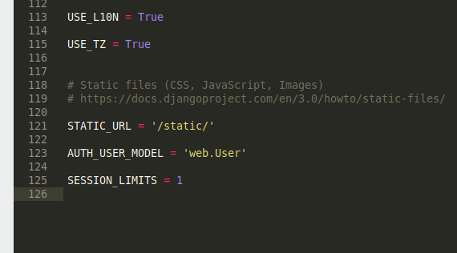
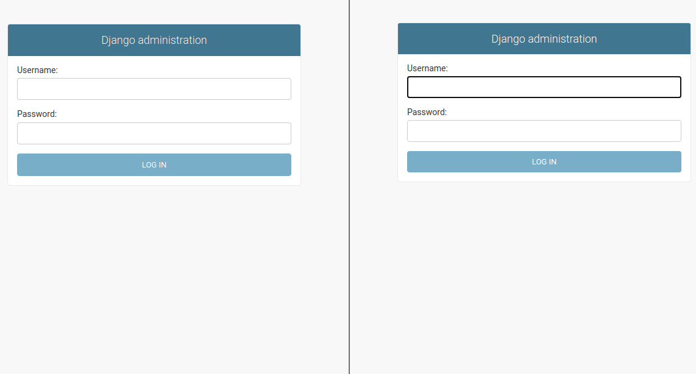
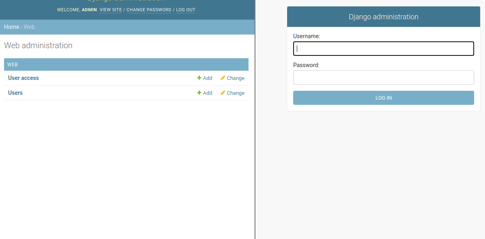
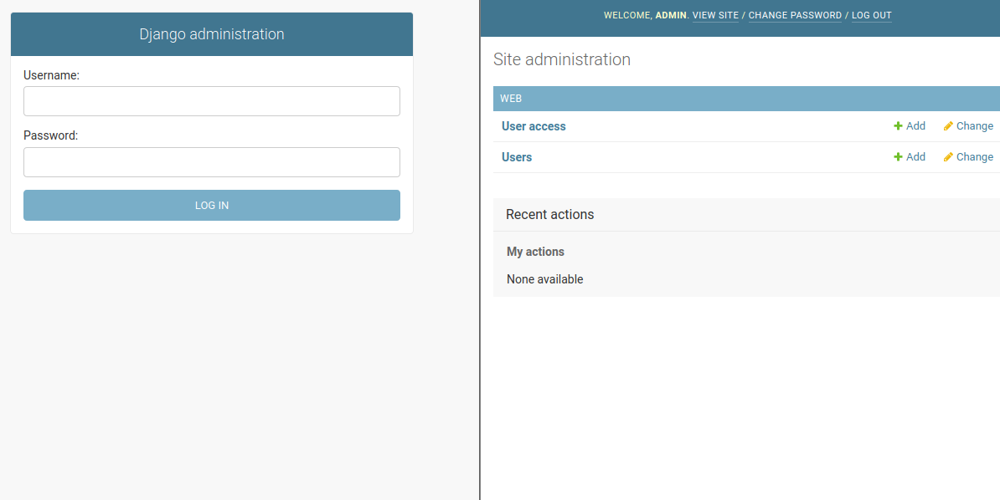

# LimitSessions

Limit sessions by authenticated users in django, in this case I will leave a variable in my **settings.py** called **SESSION_LIMITS**

In my case the limit of sessions per user will be 1, but you could add more if necessary

In order to do the test I will have to use two browsers, as you can see below

So we are going to start the session with our administrator user

**Note: user is admin and the password is holamundo**

And we can enter, at that time we will see our tables that store some data that allow this operation

But if we enter the other browser and try to do some operation on the other side

**Our session will be closed**

**Remember that in our configuration we define that it is a session per user**

## Requirements
This small project only needs django version 3

## Credits
This project would not be possible without:
- https://www.djangoproject.com/
